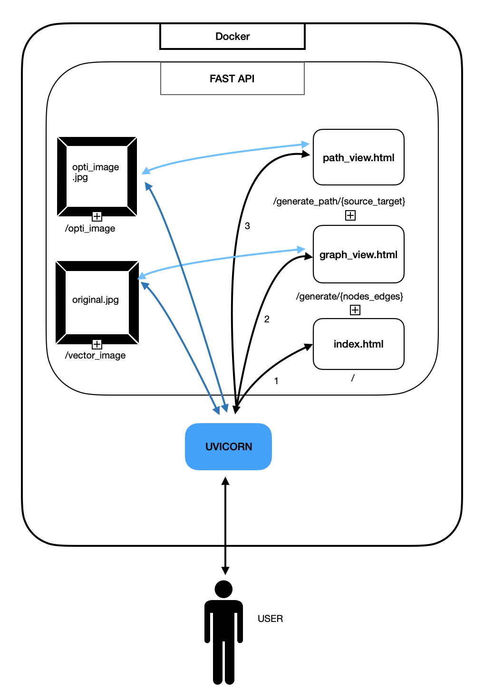

# SD_WAN_FASTAPI
#### API made on fastAPI (python) to start our API sharing our features form our SD wan project

WIP : 
remplir la GenerateOnosStruc

chercher d'autre features

## Explication du projet

Ce projet consiste à intégrer notre projet de fin d’étude à une api.

Notre projet de fin d’étude consiste à créer ou retirer un réseau et de trouver le meilleur chemin pour envoyer une information d’un point A à un point B. 
Ce réseau est représenté par une série de nodes reliés entre eux par des arcs. Chaque nodes peut avoir jusque’a 5 connections. 
Chaque connexion contient des caractéristiques ( capacité, utilisation, bandwidth ratio et delay ) qui influe sur la chemin finale que nous prendront. Il y a 6 solutions possible en fonction du critère que nous cherchons ( minimal delay , minimal bandwidth, minimal score, shortest path … ).
Dans notre pfe, nous utilisons les librairies suivantes : 

Maintenant nous souhaitons intégrer notre projet de fin d’etude dans une API. 
Notre web app se separe en trois fichiers html : 

**index.html** : page d’accueil dans lequel l’utilisateur choisis le nombre de noeuds et le nombre de connexions entre les noeuds.

**graph_view.html**: page permettant de choisir le chemin que doit traverser le message dans le réseau créé, l’image du réseau créé peut être téléchargé.

**path_view.html**: page permettant de visualiser le chemin que prend le message, l’image du chemin que prend le message peut aussi être téléchargé.

Notre API contient ainsi 6 chemins : 

**‘/‘** retourne la page index.html

**‘/generate/{nodes_edges}’** retourne la page  graph_view.html

**‘/generate_path/{source_target}’** retourne la page path_view.html

**‘/vector_image’** retourne l’image du réseau créé, utilisé dans la balise \ de la page graph_view

**‘/opti_image’** retourne l’image du chemin optimal que prend le message, utilisé dans la balise \ de la page path_view.html

Voici un schema expliquant les interactions que l’utilisateur a avec notre API

Enfin nous avons choisi de dockersé notre projet afin que le projet soit utilisé par toute personne en dehors de l’OS qu’utilise leur PC.

L’utilisateur n’a qu’a télécharger le projet GitHub, cree le container puis lancer la derniere image du container.

## Explication des technologies

**Fast API**
: Fast API est un framework permettant de créer des APIs. Il existe d’autre frameworks pour python tels que Django et Flask. Fast API est inspiré de Flask mais apport aussi d’autres fonctionnalités tels que gérer des fonctions asynchrones, valider les entrees et sorties des données. Nous avons choisi d’utiliser Fast API permis les autres frameworks car il est simple d’utilisations et les options de réponses ( html ou streaming responses )nous permette de facilement organiser notre API.

**UVICORN**

: Uvicorn est une implementation de sever ASGI (Asynchronous Server Gateway Interface ) permettant notre application de communiquer avec le serveur déployé. Contrairement à Flask qui utilise WSGI qui ne peut qu’exécuter nativement des taches synchrones, Uvicorn communique de manière asynchrone. Cela nous permet d’effectuer plusieurs taches en meme temps et donc évite le “freeze”

**DOCKER**

: Le logiciel Docker est une technologie de conteneurisation qui permet la création et l’utilisation de conteneurs. Un conteneur est une unite de software permettant d’isoler une application d’un OS solvant la problématique du “ca ne marche pas sur mon ordinateur”. Lorsque nous créons une conteneur, une image de conteneur lui est attribue, cette image (contient les dependences, configuration, scripts etc ), lorsqu’elle est lancée, exécute l’applications et données contenues a l’intérieur d’elle meme grace au DockerFile. Le DockerFile est un Text-Based script d’instructions utilisé pour créer l’image du conteneur.

## Ce que l'on a appris

En plus d'un aperçu de l'utilité des APIs et leurs scalabilités verticales, nous avons appris a faire un choix entre plusieur techno. Car dans le monde de l'entreprise ce genre de choix est très commun. Nous avons aussi découvert les Dockers et la puissance que cela peut avoir en terme de micro-gestion. De plus le mélange des différents langage de programmation a aiguisé notre capacité à assosier les différentes techno. 

## Ce que l'on vas réutiliser 

Nous avons envie de dire que tout les heures passé sur ce projet nous ont appris quelque chose de nous allons utiliser/ Notamment le Docker et la librairie Fast API.

## Nos difficultés

Durant le projet nous avons eu quelques difficutés surtout notamment pour relier les ressources au site web et pouvoir afficher les
ressources (en faisant appel aux liens).

Nous avons echoué l'affichage d'un rendu des données des calculs à savoir faire passer un tableau au site web. Nous avons essayé
de le convertir en DataFrame pandas puis de le convertir en image pour enfin le faire afficher a l'aide d'une balise .
On aurai pu aussi le convertir en json, utiliser un response json de l'API puis utiliser un script javascript pour faire apparaitre 
le json sous forme de tableau.

Enfin il aurai ete possible de relier l'api a une base de donnée qui enregistrerai les donnees pour qu'ensuite l'utilisateur fasse appelle 
à cette base de donnée. Un ODM ou ORM aurai pu être utilisé dépendant de l'information que nous aurions voulu stocker.

## Pour commencer

Pre-requis

docker : https://docs.docker.com/docker-for-windows/install/

## Installation

docker : https://docs.docker.com/docker-for-windows/install/

Lancer une console 
docker build -t sdwanapi .

docker run -d --name sdwanapicontainer -p 80:80 sdwanapi

 
 aller sur http://127.0.0.1:8000/
 ou sur http://127.0.0.1:8000/docs

Demarrage
But : Mettre a disposition de une ou plusieurs features du projet SD WAN

sur le "/" on peux trouver les differentes features et leurs docus

### Versions
0.02

### Auteurs

A-Wpro, tompa97, thomas tranchet

